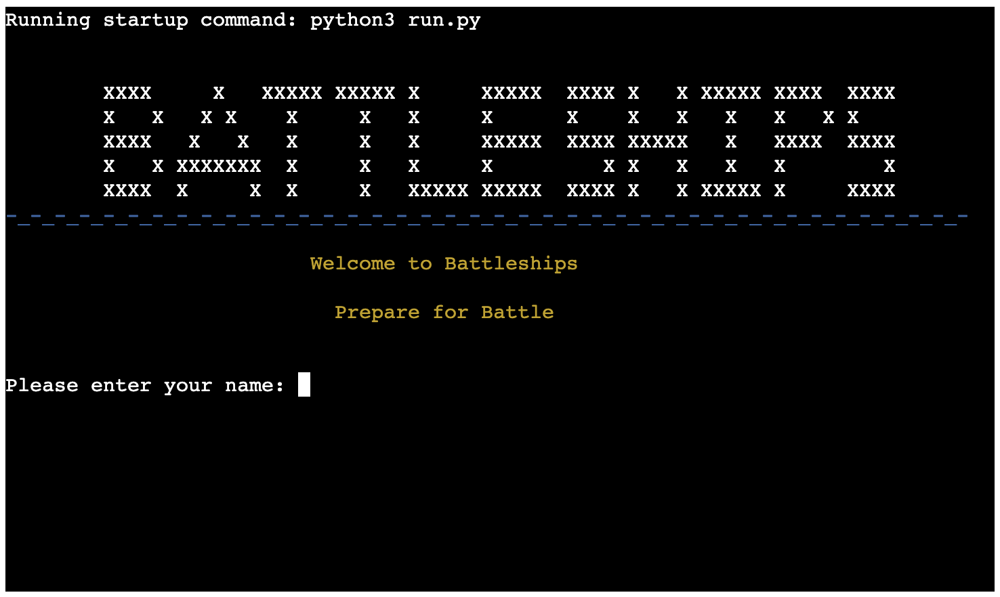
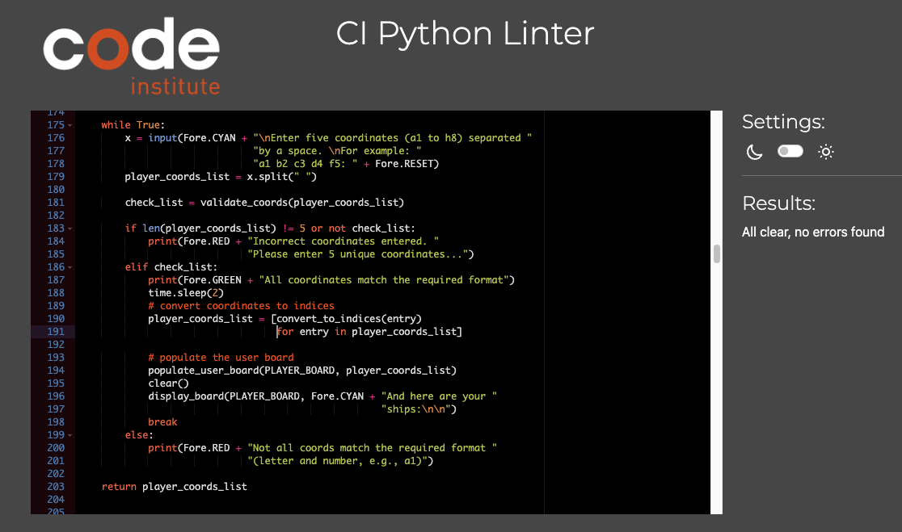

# Battleships
Link to deployed app: https://battleships-bgc-a8f0f32ea97f.herokuapp.com/



### User Demographic
The Battleships game is intended for any user. 

### Purpose
Battleships is a classic game. This version is written for a human user vs a computer opponent. 
The game is intended to be easily played, containing straightforward instructions, visual UX and prompts for the user throughout.

### Instructions
The aim of the game is to find/hit all five of your opponents ships before they find yours.

At the start of the game the user enters their name and can then choose to start the game or read the instructions.

Game start 

Player chooses 5 coordinates (a1 to h8) for their ship placement.

5 CPU ships are randomly generated. 

The starting player is radomly chosen and player/cpu take turns. Player is prompted to enter coordinates for their guess and a 
guess board is updated for a visual representation of the game. CPU coordinates are randomly generated.

If a Miss is scored then the coordinate on the guess board is popluated with a O.

For a Hit the board is populated with an X.

Turns continue until either player or cpu scores 5 hits.

User then has option to play again or exit the game.

### Features
The app contains various user prompts which require specific data to be inputted for the game to function.

Validations are in place for all these areas to ensure data is correct:

Username: Player can enter their name at the start of the game and this is used throughtout the game to make the game more personal. User input is validated to ensure username entered is between 3 and 8 characters and only contains letters.

Placing ships: The five player coordinates are checked to ensure they are the correct number and correct format (a1) and are all unique.
The five cpu ships are randomly generated using 'randint'and checked to avoid any repeats and that they are chosen from the accetable range of valid coordinates.

Choosing coordinate for shot: The user inputed coordinate is checked to ensure it matches the correct format, is within range and hasn't already been tried. The cpu shot can only be chosen randomly from within the correct range and is also checked to make sure repeat shots don't happen.

Visual representation of the player board is used to aid player in choosing their initial five coordinates.

Visual representations of the player and cpu guess boards display hit and miss information for each turn.

A function to count score updates at the end of each player and cpu turns and a score board is updated and displayed throughout the game.


### Future development

Integrating User Accounts to allow for high score and number of games data to be collected.

Add an exit key for the user to be able to break out of the game at any point.

Different board sizes.

Different ship sizes.


### Data model/Technologies/structures used
This app was created using python 3.
All code written using a virtual environment (venv) within vs code.
Code was pushed to github and deployed to Heroku.

## Testing

The following tests were carried out to ensure succesful operation and deployment of the app.

All tests achieved the expected result (pass).

| Function                    | Test                                           | Result |
|-----------------------------|------------------------------------------------|--------|
| Enter username              | Enter less than 3 characters                   | Given error message and a chance to try again|
|                             | Enter more than 8 characters                   | Given error message and a chance to try again|
|                             | No value entered                               | Given error message and a chance to try again|
|                             | Enter incorrect character (number of symbol)   | Given "invalid charcters" error message and a chance to try again|
|                             | Enter username between 3 - 8 letters           | Greeting displayed and game options displayed|
| Game Options                | Incorrect number entered (3 or above)          | Error message "Incorrect choice" displayed and re-prompt for user input|
|                             | Negative number entered (-1 or lower)          | Error message "Incorrect choice" displayed and re-prompt for user input|
|                             | Single or multiple Letter entered              | Error message "Incorrect choice" displayed and re-prompt for user input|
|                             | Symbol entered                                 | Error message "Incorrect choice" displayed and re-prompt for user input|
|                             | No value entered                               | Error message "Incorrect choice" displayed and re-prompt for user input|
|                             | '1' entered                                    | "Running the game" message displays. Game starts correctly|
|                             | '2' entered                                    | Instructions of the game are displayed then user re-prompt for game options|
| Re-prompt game options      | Tested as Game Options above                   | All tests passed|
| Choose player coordinates   | aa bb cc (just chars)                          | "Incorrect coordinates entered.." error message displayed. Re-prompt user for correct values|
|                             | 11 66 99 (just numbers)                        | "Incorrect coordinates entered.." error message displayed. Re-prompt user for correct values|
|                             | 12 15 48 965 52                                | "Incorrect coordinates entered.." error message displayed. Re-prompt user for correct values|
|                             | cf 4g h8 d2 f89 (mix of correct/incorrect vals)| "Incorrect coordinates entered.." error message displayed. Re-prompt user for correct values|
|                             | a1 a2 a3 a4 a4 (repeat entries)                | "Incorrect coordinates entered.." error message displayed. Re-prompt user for correct values|
|                             | a1,b4..Correct vals separated by comma         | "Incorrect coordinates entered.." error message displayed. Re-prompt user for correct values|
|                             | Correct vals separated by double space         | "Incorrect coordinates entered.." error message displayed. Re-prompt user for correct values|
|                             | Symbols entered                                | "Incorrect coordinates entered.." error message displayed. Re-prompt user for correct values|
|                             | No value entered                               | "Incorrect coordinates entered.." error message displayed. Re-prompt user for correct values|
|                             | Correct coords with uppercase letters          | "All coordinates match required format" message displayed. Game continues|
|                             | Correct coords with lowercase letters          | "All coordinates match required format" message displayed. Game continues|
| Press ENTER to start the game| "Enter" pressed                                | Game continues|
|                             | Any other key entered                          | Nothing happens until "Enter" is pressed. Then game continues|
| Player shot (user input)    | Double letter entered (aa or hh or ty)         | "Invalid coordinates!!!" message displayed. Re-prompt user for correct values|
|                             | Double number entered (22, 56, 89)             | "Invalid coordinates!!!" message displayed. Re-prompt user for correct values|
|                             | 3 or more letters entered (abc)                | "Invalid coordinates!!!" message displayed. Re-prompt user for correct values|
|                             | 3 or more numbers entered (637)                | "Invalid coordinates!!!" message displayed. Re-prompt user for correct values|
|                             | Symbols entered (a£, g", (6, ,,)               | "Invalid coordinates!!!" message displayed. Re-prompt user for correct values|
|                             | Out of range coord enetered (h9, l2)           | "Invalid coordinates!!!" message displayed. Re-prompt user for correct values|
|                             | No value entered                               | "Invalid coordinates!!!" message displayed. Re-prompt user for correct values|
|                             | More than one correct coordinate entered       | "Invalid coordinates!!!" message displayed. Re-prompt user for correct values|
|                             | Repeated value entered                         | "You already tried that one" displayed. Re-prompt user for correct values|
|                             | Enter pressed before the prompt                | "Invalid coordinates!!!" message displayed. Re-prompt user for correct values|
|                             | Correct value entered (a1 to h8 tried)         | Game continues. Hit/Miss recorded and score updated as expected| 
| Press ENTER to continue..   | "Enter" pressed                                | Game continues|
|                             | Any other key entered                          | Nothing happens until "Enter" is pressed. Then game continues|
| Coordinate is a Miss        | Coordinate doesn't match opponents ship        | Player/Cpu (current player) guess board updated with 'O', 'Miss' displayed. Score updated. Game continues|
| Coordinate is a Hit         | Coordinate matches opponents ship              | Player or Cpu (current player) guess board updated with 'X'. 'Hit' displayed. Score updated. Game continues|
| All other player shots      | Tested as player shot above                    | Results as Player Shot above. Game continues|
| Endgame choice              | Invalid number entered (8, 967)                | "Invalid choice" displayed. Re-prompt user for correct value|
|                             | Invalid character entered (G, $, ;)            | "Invalid choice" displayed. Re-prompt user for correct value|
|                             | No value entered                               | "Invalid choice" displayed. Re-prompt user for correct value|
|                             | Negative value entered (-1, -2)                | "Invalid choice" displayed. Re-prompt user for correct value|
|                             | '1' entered                                    | Game restarts after message and countdown displayed|
|                             | '2' entered                                    | Game exits after message is displayed|


## Bugs


### Solved Bugs
| Bug                                                       | Solution                                          |
|-----------------------------------------------------------|---------------------------------------------------|
| The score wasn't updating in game                         | Score was only being updated at start of game. Moved inside game while True loop.|
| Guess boards being updated incorrectly                    | Adjust [row] to [row - 1] to compensate.|
| end_game() creating an infinte loop                       | Move user input inside the while loop.|
| os.system('clear') not working on all os's                | Import sys library. Add a clear() function to ensure app works accross windows, macos and linux.|

### Existing bugs
Keypresses by the user during the instructions cause the next input at prompt to be incorrect. I haven't been able to solve this but believe some disable.keyboard from the keyboard library may help.

### pep8 validation
All code was run through the pep8 linter at https://pep8ci.herokuapp.com/#

Any warnings were fixed before final deployment.




## Deployment Steps
### Github
The site was created using the Visual Studio Code editor and pushed to github to the remote repository https://github.com/bengilbertcodes/battleships

The following git commands were used throughout development to push code to the remote repo:

```git add .``` - This command was used to add the file(s) to the staging area before they are committed.

```git commit -m "commit message..."``` - This command was used to commit changes to the local repository queue ready for the final step.

```git push``` - This command was used to push all committed code to the remote repository on github.
### Heroku
The below steps were followed to deploy this project to Heroku:

* Go to Heroku and click "New" to create a new app.
* Choose an app name and region region, click "Create app".
* Go to "Settings" and navigate to Config Vars. Add the following config variables:
    * PORT : 8000
* Navigate to Buildpacks and add buildpacks for Python and NodeJS (in that order).
* Navigate to "Deploy". Set the deployment method to Github and enter repository name and connect.
* Scroll down to Manual Deploy, select "main" branch and click "Deploy Branch".
* After a short wait the app will now be deployed to heroku.
* click View to see and use the app.


## Credits

Thanks go to:

* Knowlegde Mavens [Youtube](https://www.youtube.com/watch?v=tF1WRCrd_HQ&t=596s&ab_channel=KnowledgeMavens) for getting my early game functions started, including the board layout and placing ships. [Github] https://github.com/gbrough/battleship/blob/main/single_player.py

* My mentor at Code Institute Gareth McGirr for his advice throughout the project and many suggestions to the project on track. 

* Dan Morriss, Malin Nilsson and Tomislav Dukez for their advice and suggestions. And also for testing the game.
